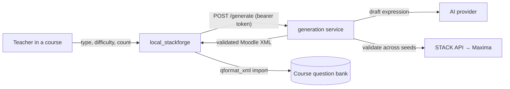

# STACK Forge — AI question generator (local_stackforge)

[](https://github.com/danielcregg/moodle-local_stackforge/actions/workflows/moodle-ci.yml)


A Moodle **local plugin** that brings AI question authoring *into* Moodle. From a course, a teacher
picks a STACK question type, difficulty and count, clicks a button, and gets **AI-drafted,
oracle-validated** [STACK](https://stack-assessment.org/) questions added straight to the course
**question bank** — ready to drop into a quiz. It can also build a whole **adaptive quiz** whose
questions follow a reinforcement-learning teaching policy's easy → hard curriculum.

The plugin is deliberately **thin and stateless**. The intelligence (AI drafting) and the oracle
(Maxima/STACK validation that *proves* each question is gradable across random variants) live in an
**external generation service** that the plugin calls over HTTP. Moodle is never forked.



## Requirements

- **Moodle 4.5 LTS** or later (developed and tested on 4.5; `$plugin->supported = [405, 405]`).
- The **STACK question type** (`qtype_stack`) installed — this plugin only emits/imports STACK XML
  and declares `qtype_stack` as a dependency.
- A reachable **generation service** that exposes `POST /generate` (and `POST /sequence` for the
  RL-sequenced quiz). A reference implementation and its `docker compose` stack are provided in the
  parent project, [stack-question-forge](https://github.com/danielcregg/stack-question-forge)
  (`infra/`). You host this yourself; the plugin ships with **no default endpoint**.

## Install

### From the Moodle Plugins directory (recommended once published)
Site administration → Plugins → Install plugins → search for *STACK Forge*.

### Manually
Copy this directory to `<moodleroot>/local/stackforge` (the folder **must** be named `stackforge`),
then visit *Site administration → Notifications* to run the upgrade, or:

```bash
php admin/cli/upgrade.php --non-interactive
```

## Configure

*Site administration → Plugins → Local plugins → STACK Forge*:

| Setting | Description |
|---|---|
| **Generation service URL** | Base URL of your generation service (e.g. `https://forge.example.edu`). Empty by default — the plugin is inert until this is set. |
| **API token** | Bearer token for the service (`FORGE_API_SECRET`). Stored server-side, never sent to the browser. Leave blank if your endpoint needs none. |

> **Internal endpoints:** the URL is admin-only and is validated (http/https, host required, no
> embedded credentials). Because deployments often run the service on an internal host (e.g.
> `http://generate:8092`), the plugin uses Moodle's `ignoresecurity` curl option **for this one
> admin-configured call**, with redirects disabled and protocols pinned. It is never user-influenced.

## Use

In a course → **Generate STACK questions** → choose type / difficulty / how many + a target
category → **Generate**. Questions are validated on the live STACK engine *before* they are added,
so they are gradable across random variants by construction. Or use **Build RL-sequenced quiz** to
generate a curriculum-ordered set and create an adaptive quiz in one click.

Requires the `local/stackforge:generate` capability (granted to editing teachers and managers by
default); adding questions and building a quiz also require the core `moodle/question:add` and
`moodle/course:manageactivities` capabilities.

## Privacy

This plugin stores **no personal data** (it implements the Moodle Privacy API null provider). It
sends only the chosen question type and difficulty to the generation service. See `classes/privacy/`.

## For reviewers

The plugin needs a backend to do anything. To exercise it end to end, stand up the reference
generation service from [stack-question-forge](https://github.com/danielcregg/stack-question-forge)
(`infra/docker-compose.yml` → the `generate` service behind a bearer-gated reverse proxy), then set
the URL + token above. Without a backend the UI loads and reports "not configured", which is the
intended inert state.

## License

[GNU GPL v3 or later](LICENSE) — the same license as Moodle.
