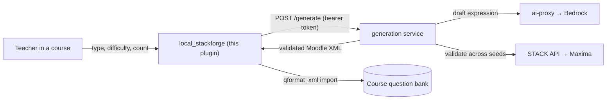

# local_stackforge — AI STACK-question generator, inside Moodle

A thin Moodle plugin that brings the forge's question authoring **into Moodle**: from a course,
a teacher picks a STACK question type + difficulty + count, clicks a button, and gets
**AI-drafted, oracle-validated** STACK questions added straight to the course **question bank** —
ready to drop into a quiz.

It keeps the project's decoupling principle: the plugin is thin and stateless; the intelligence
(AI drafting) and the oracle (Maxima/STACK validation) live in the **external generation service**
the plugin calls. Same pattern as `local_aitutor` (hints) — Moodle is never forked.



## What it does
- Adds a **"Generate STACK questions"** link to a course (for editing teachers / managers).
- Calls the **`/generate`** endpoint (the `generate` service behind Caddy, bearer-token gated) for
  N validated questions of the chosen type/difficulty.
- Imports each returned `<question type="stack">` XML into a chosen question category using
  Moodle's standard XML import — so they behave exactly like manually-authored STACK questions.

## Requirements
- Moodle 4.4+ with the **STACK question type** (`qtype_stack`) installed (this only emits STACK XML).
- The stack-question-forge backend with the **generation service** deployed (see
  `infra/docker-compose.yml` → the `generate` service + the `/generate` Caddy route).

## Install
```bash
# copy this folder to <moodle>/local/stackforge, then run the upgrade
docker cp local_stackforge moodle-moodle-1:/var/www/html/local/stackforge
docker exec -u www-data moodle-moodle-1 php /var/www/html/admin/cli/upgrade.php --non-interactive
```
Then set the service URL + token in **Site administration → Plugins → Local plugins → STACK Forge**:
- **Generation service URL** — the same API base your STACK questions validate against
  (e.g. the Cloudflare tunnel, or `https://api.stackquestionforge.tech` once live).
- **API token** — `FORGE_API_SECRET` (the bearer token; stored server-side, never sent to the browser).

## Use
In a course → **Generate STACK questions** → pick type/difficulty/how-many + a category → generate.
The questions are validated on the live STACK engine *before* they're added, so they're gradable
across random variants by construction.

## Status
Code complete; **pending a live install/test on the Moodle 4.5 demo** (the Moodle question-import
API has version-specific edges worth verifying on the target instance before relying on it).
The generation service it calls is **deployed and verified**.

## Roadmap (the end goal: everything inside Moodle)
- This plugin = authoring inside Moodle. ✅ (code)
- `local_aitutor` = live AI hints inside quizzes. ✅ (deployed)
- Next: wire the **RL policy** (`phase3/policy_service`) into `local_aitutor` so the next question
  is chosen by the learned teaching policy — completing the author → tutor → teach loop in Moodle.
