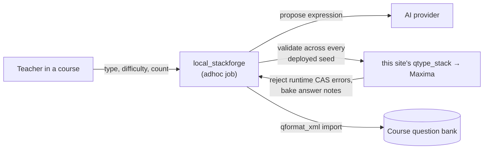

# STACK Forge — AI question generator (local_stackforge)

[](https://github.com/danielcregg/moodle-local_stackforge/actions/workflows/moodle-ci.yml)


A Moodle **local plugin** that brings AI question authoring *into* Moodle. From a course, a teacher
picks a STACK question type, difficulty and count, clicks a button, and gets **AI-drafted,
oracle-validated** [STACK](https://stack-assessment.org/) questions added straight to the course
**question bank** — ready to drop into a quiz.

**The AI is never trusted to assert a correct answer.** Per-type deterministic templates own the
randomisation, grading (PRTs) and question-tests; the AI only proposes a *source expression*. The
question's own Maxima then **computes** the teacher answer, and STACK **proves** the model answer
scores full marks across random variants. A wrong or odd AI expression simply fails validation and is
retried (then a known-good template default is used).

## Two modes

| Mode | Backend needed | What it does |
|---|---|---|
| **In-process** (recommended) | **None** — just an AI key | Drafts and validates against **this site's own `qtype_stack` + Maxima**. Install the plugin, paste an AI key, done. |
| **External** | A generation service over HTTP | Calls the decoupled [stack-question-forge](https://github.com/danielcregg/stack-question-forge) pipeline. Useful if you want generation off the Moodle box, or to also build an RL-sequenced adaptive quiz. |

The default mode is **auto**: if you have already configured an external service URL it is used (so an
existing site is never silently switched), otherwise the plugin runs in-process.



Generation runs as a background **adhoc task** (CAS validation across seeds is slow), so the course
page queues the job and shows live progress rather than blocking the request.

## Requirements

- **Moodle 4.5 LTS** or later (developed and tested on 4.5; `$plugin->supported = [405, 405]`).
- The **STACK question type** (`qtype_stack`) installed and working (with its Maxima configured). This
  plugin declares `qtype_stack` as a dependency and, in in-process mode, uses its validation engine.
- For the **differentiate** and **integrate** types: an **AI API key** (any OpenAI-compatible
  provider, Anthropic, or Google Gemini) to draft expressions. The other six types generate entirely
  from built-in templates and need no AI.
- **Cron** must be running (standard Moodle requirement) so queued generation jobs execute.

## Install

### From the Moodle Plugins directory (recommended once published)
Site administration → Plugins → Install plugins → search for *STACK Forge*.

### Manually
Copy this directory to `<moodleroot>/local/stackforge` (the folder **must** be named `stackforge`),
then visit *Site administration → Notifications* to run the upgrade, or:

```bash
php admin/cli/upgrade.php --non-interactive
```

## Configure

*Site administration → Plugins → Local plugins → STACK Forge*:

| Setting | Description |
|---|---|
| **Generation mode** | `Auto` (default), `In-process`, or `External`. |
| **AI provider / model / key** | For in-process mode. The key is stored server-side and never sent to the browser. Leave the provider as *None* to use only the built-in template expressions (no AI calls). |
| **Generation service URL / API token** | For external mode only. Empty by default. |

There is also an **in-process smoke test** page (linked from the settings) that builds one known-good
question, validates it across all deployed seeds against your Maxima, and deletes it — a one-click way
to confirm in-process mode works on your site.

> **Internal endpoints (external mode):** the service URL is admin-only and validated (http/https,
> host required, no embedded credentials). Because deployments often run the service on an internal
> host (e.g. `http://generate:8092`), the plugin uses Moodle's `ignoresecurity` curl option **for this
> one admin-configured call**, with redirects disabled and protocols pinned. It is never user-influenced.

## Use

In a course → **Generate STACK questions** → choose type / difficulty / how many + a target category →
**Generate**. The job is queued; the page refreshes and reports each validated question as it lands in
the bank. Every question is proven gradable across random variants *before* it is added.

Requires the `local/stackforge:generate` capability (granted to editing teachers and managers by
default); adding questions and building an RL quiz also require the core `moodle/question:add` and
`moodle/course:manageactivities` capabilities.

## How in-process validation works (the oracle)

For each drafted question the plugin imports it into a temporary, job-scoped scratch category, then:

1. **Instantiates it across every deployed seed** and rejects any **runtime CAS error** — so a
   grammar-valid but non-elementary integrand (e.g. `sqrt(x^3+1)`) cannot slip through as a broken
   question. (`$question->runtimeerrors`, `validate_for_bulk`, `validate_against_stackversion`, and per-PRT
   errors are all checked.)
2. **Discovers and bakes the terminal answer notes** from the PRT results, so the exported
   question-tests match STACK's own comparison exactly.
3. **Proves the exported question passes its own question-tests** across all seeds via Moodle's
   authoritative `test_question()` — the same engine behind *Test this question*.

The scratch category is deleted immediately afterwards; a scheduled task removes any scratch a fatal
or timeout might leave behind.

## Privacy

This plugin records each **generation job** a user requests (in `local_stackforge_jobs`: the user, the
course, the chosen type/difficulty, the status and timestamps) and implements the full Moodle Privacy
API to export and delete that data. In in-process mode it discloses the chosen **question type and
difficulty** (never any user information) to the configured AI provider. See `classes/privacy/`.

## For reviewers

Out of the box the plugin is inert: it contacts no AI host until an administrator configures a
provider/key, and contacts no external service unless a URL is set. The recommended way to exercise it
is **in-process mode** on a site that has `qtype_stack` + Maxima working: set an AI provider/model/key
and use the smoke-test page, or generate from a course. External mode is documented above for sites
that prefer an off-box generation service.

## License

[GNU GPL v3 or later](LICENSE) — the same license as Moodle.
